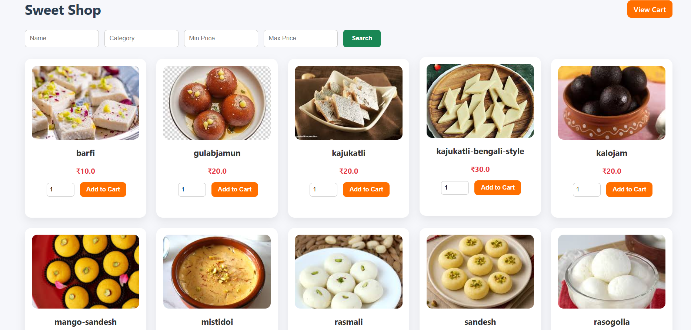
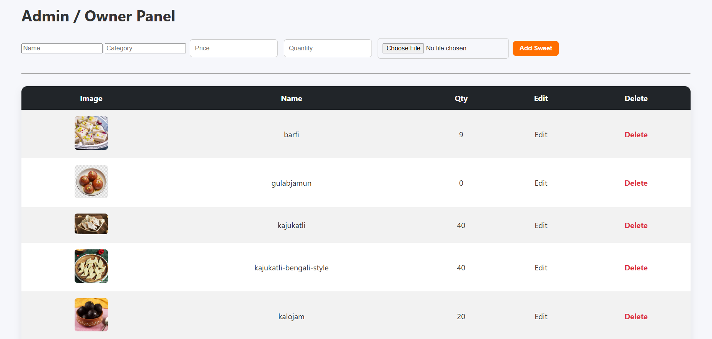

🍬 Sweet Shop Management System

A full-stack **Sweet Shop Management System** built using **Spring Boot, Thymeleaf, MySQL**, and **Test-Driven Development (TDD)**.

This system allows customers to browse and purchase sweets while enabling admins to manage inventory and stock efficiently.

---

## 📌 Project Overview

This project is part of a **TDD Kata** and demonstrates:
- Clean backend architecture
- Inventory and stock management
- Prevention of over-purchasing
- Proper use of testing and version control
- Transparent AI-assisted development

---

## 🚀 Features

### 👤 Customer
- Browse available sweets
- Search by name, category, and price range
- Add sweets to cart
- Cannot add more quantity than available stock
- View cart and checkout

### 🛠 Admin / Owner
- Add new sweets
- Update price and quantity
- Delete sweets
- Manage inventory

---

## 🧱 Tech Stack

**Backend**
- Java 21
- Spring Boot
- Spring MVC
- Spring Data JPA
- Hibernate
- MySQL

**Frontend**
- Thymeleaf
- HTML
- CSS
- Bootstrap

**Testing**
- JUnit 5
- Mockito
- Spring Boot Test
- MockMvc

**Tools**
- Maven
- Git & GitHub
- Eclipse IDE

---

## 🧪 Test-Driven Development (TDD)

This project strictly follows **TDD**:

1. 🔴 RED – Write failing tests
2. 🟢 GREEN – Write minimum code to pass tests
3. 🔵 REFACTOR – Improve structure and readability

### Tested Areas
- Service-layer business logic
- Stock validation (no overselling)
- Controller tests using `@WebMvcTest`
- Exception handling

All tests pass successfully.

---

## 📸 Application Screenshots

### 🏠 Home Page


### 🛍 Customer Sweet Listing


### 🛠 Admin / Owner Panel


---

## ⚙️ How to Run Locally

### Prerequisites
- Java 21
- Maven
- MySQL

---

### 1️⃣ Clone Repository
```bash
git clone https://github.com/sumanking/sweetshop.git
cd sweetshop
2️⃣ Configure Database
Create database:

sql
Copy code
CREATE DATABASE sweetshop;
Update application.properties:

properties
Copy code
spring.datasource.url=jdbc:mysql://localhost:3306/sweetshop
spring.datasource.username=YOUR_USERNAME
spring.datasource.password=YOUR_PASSWORD
spring.jpa.hibernate.ddl-auto=update
3️⃣ Run Application
bash
Copy code
mvn spring-boot:run
4️⃣ Access Application
Home Page: http://localhost:8080

Customer Page: http://localhost:8080/customer

Admin Page: http://localhost:8080/admin

🧾 Test Report
All unit and controller tests pass

Stock validation fully covered

No failing tests

Run tests using:

bash
Copy code
mvn test
🤖 My AI Usage
AI Tools Used
ChatGPT (OpenAI)

How I Used AI
Designing controller and service structure

Writing unit and controller tests

Debugging Spring Boot and MockMvc issues

Improving commit messages and refactoring

Reflection
AI helped speed up development and improve clarity.
All business logic, validations, and final decisions were implemented and verified by me.

🧑‍💻 Git & Commit Practices
Frequent commits following TDD flow

Clear and descriptive commit messages

AI co-authorship added where applicable

Example Commit
vbnet
Copy code
refactor: improve structure and readability of SweetRestControllerTest

Co-authored-by: ChatGPT <AI@users.noreply.github.com>
📦 Deliverables
Public GitHub repository

Complete README.md

Application screenshots

Test suite & report

AI usage documentation

👤 Author
Suman Acharyya
Final Year B.Tech (CSE)
Aspiring Software Engineer

© 2025 Sweet Shop Management System
Built with Spring Boot & Thymeleaf
